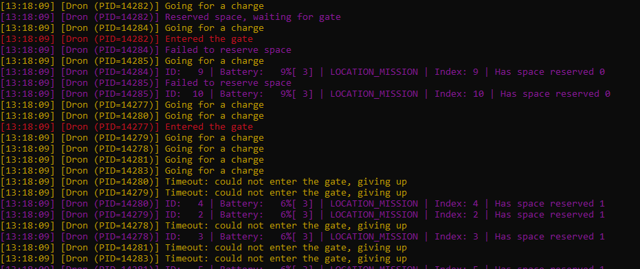
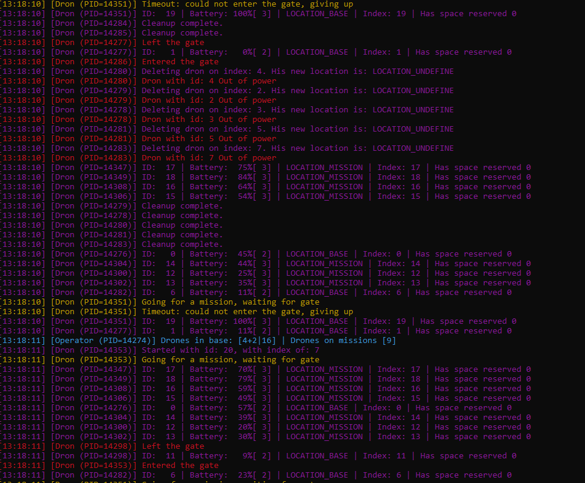

# FIFO Semaphore Test — Gate Access (Drones)

## Test goal

Verify that the maximum number of drones inside the gate is **two at any time**.
And other drones wait for gate to be free.


---

## Recommended start parameters (clear and readable logs)

These settings make FIFO behavior easiest to observe in logs and screenshots.

```bash

./main_program -n 10 -m 50 -g 1000000
# n for starting drones, 10 was chosen to make screenshots simpler to take
# m for drones allowed in memory
# g allows us to change how long it takes for a drone to use the gate (Warning! dont go to large on that,
# as it may cause problems with closing the app, as drones cant be destroyed while inside the gate)

```

## Test steps, and observations.

First, we can observe that drones with PIDs **14282** and **14277** entered the gate.

We also see a group of other drones attempting to charge. However, once the gate closes after some time, they stop
waiting and decide to try again later.

This is indicated by the message:
*"Timeout: could not enter the gate, giving up"*



---

After some time, we can see that the drone with PID **14277** has left the gate.

Immediately after that, the drone with PID **14286** entered the newly freed spot in the gate.

After that, we can search the logs for similar patterns: drones leaving the gate and other drones immediately occupying
the newly freed spot.



---

## Conclusion

The observed behavior confirms that the FIFO semaphore correctly limits gate access
to two drones at a time.
