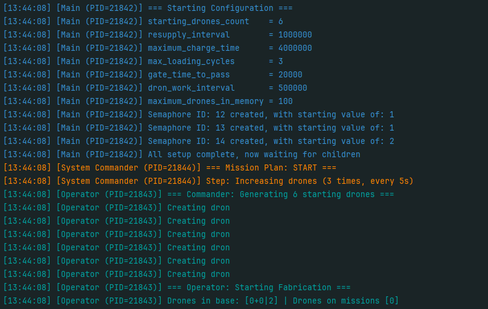
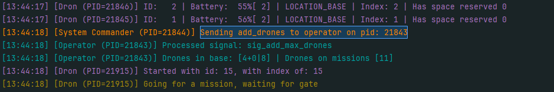
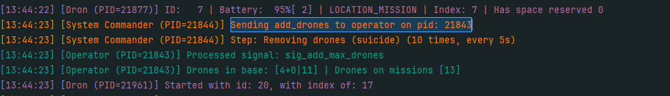
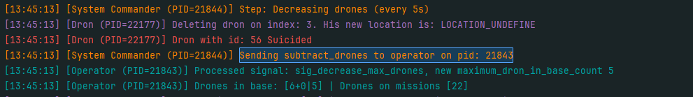
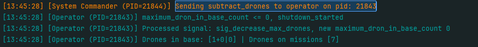
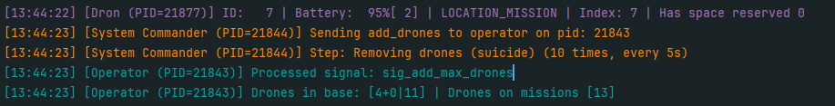
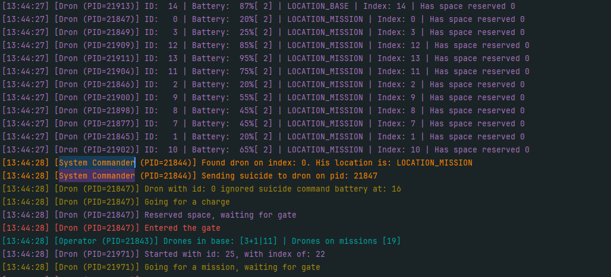
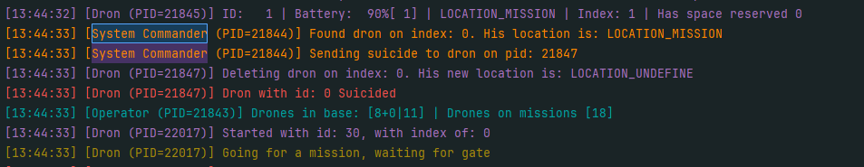

# Signals Communication Test

## Test goal

Verify correct signal-based communication between:

- the **system commander** and the **operator**
- the **system commander** and the **drones**

The test ensures that signals are properly sent, received, and handled, resulting in the expected system behavior.

---

## Recommended start parameters (clear and readable logs)

These settings make signal exchanges and their effects easiest to observe in logs and screenshots.

```bash
./main_program
# Testing with default parameters
```

## Test steps, and observations.

### System Commander → Operator Signals Test

Here we can see the initial configuration. What is important for this test is:

- the **System Commander** is running and the current mode is *Increasing drones*
- the **Operator** has the maximum number of drones in the base set to **2**



---

The System Commander sends a signal requesting to add drones, and the Operator
processes this signal, increasing the maximum number of drones in the base to **4**.


Further increases are also visible:



---

Here we can observe an interesting behavior. The maximum number of drones in the base
increases to **11**, which is lower than the initially anticipated value of **16**.

However, this behavior is correct. According to the specification, the maximum number
of drones must be **less than `2 × starting_drones`**.  
For this simulation, the number of starting drones is **6**, so **11** is the correct
maximum value.



---

The System Commander sends the `subtract_drones` signal to the Operator, which then
reduces the maximum number of drones on the platform to **5**.



Further decreases are also visible:


---

Here, we finally reduce the maximum number of drones on the platform to **0**,
which marks the beginning of the natural termination of the simulation.



---

At this point, we can see the System Commander sending the `subtract_drones` command
one last time. However, the Operator is no longer available to receive it, as it is
in the process of shutting down.

The System Commander then waits for its child processes to finish execution.


---

### System Commander → Drone Signals Test

Here we can see the System Commander transitioning to the phase where it sends
**suicide signals** to drones.



---

After identifying a drone with PID **21847**, the System Commander sends a signal to it.
In this case, we observe an interesting edge case: the drone’s battery level is below
**20%**.

As a result, the drone receives the signal but **intentionally ignores it**, following
the defined behavior for low-battery conditions.



Here we can see the System Commander making one more attempt. This time,
the signal is successfully handled and the drone performs the suicide action.


---

## Conclusions — Signal-Based Communication

The signal-based communication between system components works correctly and
reliably. Signals sent from the **System Commander** to the **Operator** are properly
received and processed, with all system constraints enforced as defined in the
specification, including correct handling of shutdown scenarios.

Communication between the **System Commander** and **Drones** is also correct.
Drones respond to control signals according to their internal state, properly handling
edge cases such as low battery conditions and executing termination when allowed.

Overall, the tests confirm robust and consistent signal handling across the system.