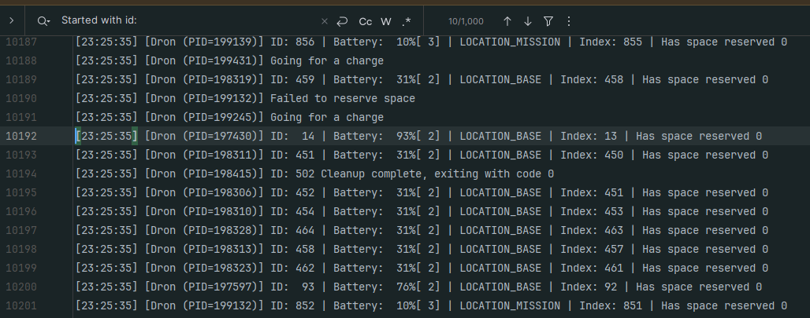
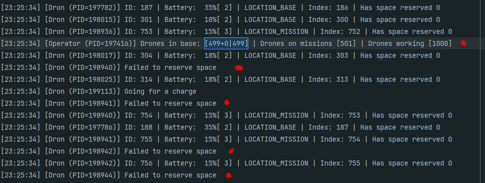
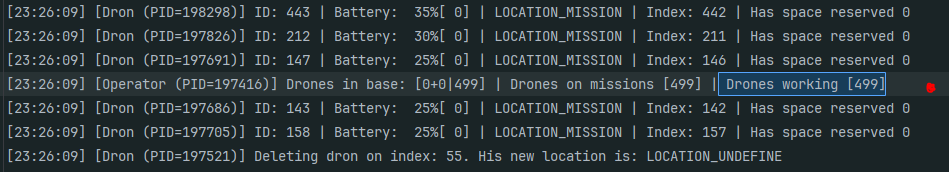
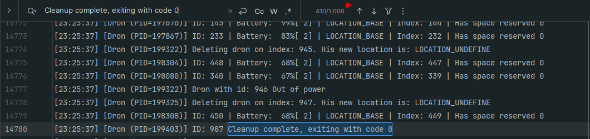

# Static Drone Population Behavior Test

## Test description

This test documents system behavior for a configuration in which **no new drones are
created during runtime**. The system operates on a **fixed initial population of 1000
drones**, each starting with a **battery level of 30%**.

The test focuses on observing how the system handles:
- loading drones into the base
- enforcing base capacity limits
- terminating drones that cannot enter the base due to insufficient capacity

---

## Test goals

The objectives of this test are to:

- verify correct initialization of a fixed drone population
- observe proper registration of drones in the base
- confirm that drones exceeding base capacity are handled correctly

---

## Recommended start parameters


```bash

./main_program -n 1000 -m 2500 -r 20000 -g 1
# n for starting drones
# m for drones allowed in memory
# r short timer for operator to better capture simulation state
# g shortest possible to minimize impact og gate on simulation

```

## Test scenario

1. The program starts with a configuration that initializes **exactly 1000 drones**.
2. Each drone is assigned an initial **battery level of 30%**.
3. The system attempts to load drones into the base, respecting the configured memory
   capacity.
4. Drones that cannot enter the base:
  - are terminated
  - release all allocated resources
5. The system continues operating with the remaining drones in the base.

---

## Observations

During the test, the following behaviors are observed:

- the number of drones inside the base never exceeds the configured limit
- drones are admitted to the base until capacity is reached
- remaining drones fail to enter and are removed from the system
- base state remains consistent after drone termination events

---

## Expected results

- exactly **1000 drones** are created at startup
- all drones start with **30% battery level**
- no drones are created after initialization
- the base correctly tracks the number of loaded drones
- drones unable to enter the base terminate without affecting system stability
- no deadlocks, memory leaks, or undefined behavior occur

---
Unfortunately, console output cannot be used directly, as it lacks complete historical
records.

However, by matching the drone creation log message, we can observe that it appears
exactly **1000 times**, which confirms that **1000 drones were created**.



---

Here we can observe the first moment when the base reaches its full capacity of
**499 drones**. From this point onward, additional drones are unable to reserve space
in the base.



---

At this stage, only **499 drones remain active**, while the remaining **501 drones**
failed to gain access to charging and were terminated.



---

Finally, we can observe that **all 1000 drones performed proper cleanup** and exited
with **exit code 0**, confirming graceful termination.



## Conclusions

The test confirms that the system correctly handles a static drone population initialized
at startup.

Exactly **1000 drones** were created with the expected initial battery level, and no
additional drones were spawned during execution. The base capacity limit was strictly
enforced, allowing a maximum of **499 drones** to be loaded at any time.

Drones that were unable to reserve space in the base terminated gracefully without
affecting the stability of the system. All drones, including those denied access to
charging, performed proper cleanup and exited with a success status.

No deadlocks, resource leaks, or undefined behavior were observed during the test,
demonstrating correct synchronization, resource management, and robust handling of
capacity constraints.